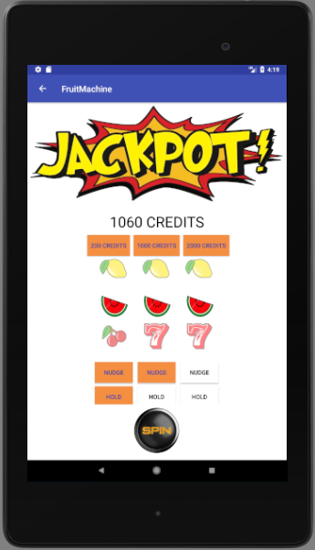

# Fruit Machine - Java with Android extension

## MVP: Create a fruit machine in Java.
- create a simple piece of software that will operate a fruit machine.
- the FruitMachine class should:
  - be well tested
  - have a spin() method that returns an integer value
    - return zero if all symbols are not identical
    - return winnings based on the symbol visible
  - allow a player to nudge and hold at random times
  - update and store a players winnings

### Project Extensions

- Allow users to choose from Symbol Packs (Different games.)
- Extend to 5 reels
- Turn into an Android app.

### Planning
- Two proto-personas, a gambler and a machine owner, with associated user journeys
- CRC cards to plan out classes and general structure
- Sketched wireframes for the Android app
- Waffle.io to keep track of progress

### I would have liked to
- Find a way to use dynamic layouts to give a choice of five (or more) reels as the Java code was already functional
- Work out how to get a consistent display on tablets and phones
- Have a way to record player spend and stop when they reach their daily limit

### I learned
- I have a long way to go before I understand layout inflaters, view inflaters, and adaptors in Android
- Smaller methods and layouts make things a lot easier

